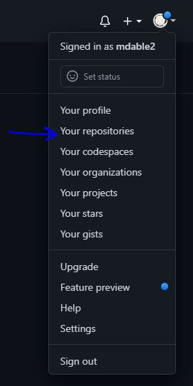
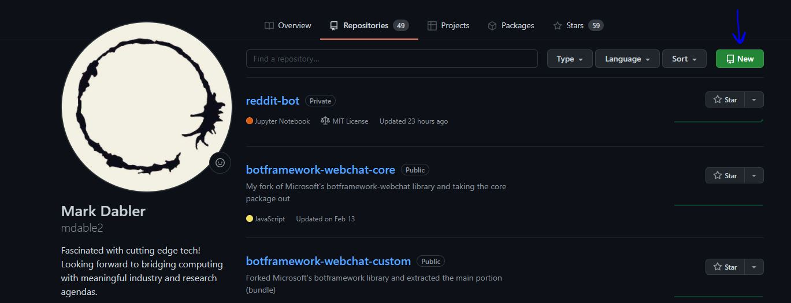
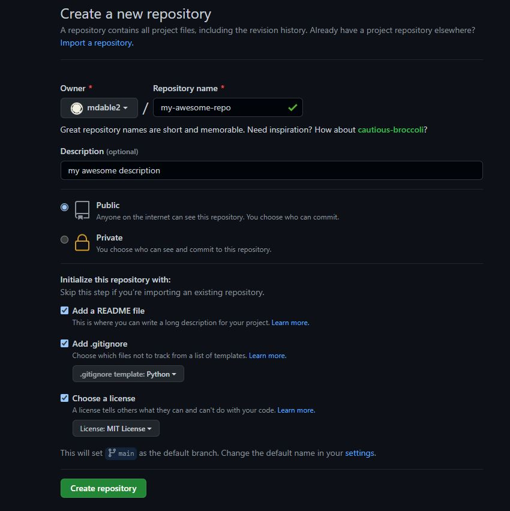
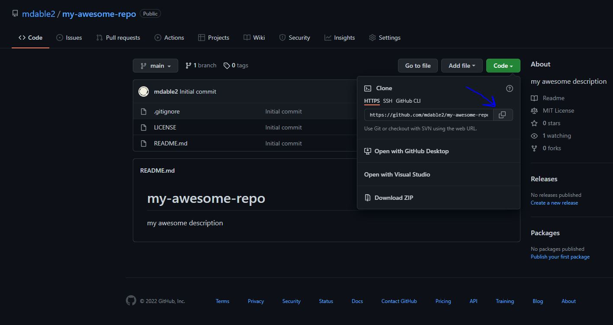
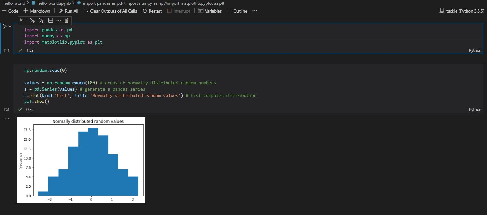

# Getting Started
Hello and welcome to the ML Ops course! Follow these steps to get your environment set up and review basic terminal skills. At the end you'll have your first project set up and ready to go.

1. Install [Anaconda](https://www.anaconda.com/products/individual).
2. Install [Git](https://git-scm.com/downloads).
3. Install [VS Code](https://code.visualstudio.com/download).
4. If you don't already have one, make an account on [Github](https://github.com/). Then login and navigate to the top right user icon, click it, go to repositories, 
   


and then click "New" (the green button).



5. Create the repository by inputting the following:
* Repo name
* Repo description
* Make repo public
* Add a README
* Add .gitignore (Python template)
* Add license (choose MIT)

Then hit "Create Repository".



6. Now that you have a repo, go to the code section and copy the HTTPS address so you can clone your repo to your local computer.



7. Open your terminal and navigate to a place where you would like to make a directory to hold all your files for this class using the command `cd`. Once there, make a top level directory using `mkdir`. `cd` into it and make another directory called `code`. `cd` into it and run your `git clone {address}` command. `cd` into your repository and type `code .` to open up your repositiory in VS Code. This should pop up a VS Code window with your repository open.
   
8. Next we will review some terminal commands and make some additions to our repo. Do these in your terminal where your current working directory is your repo.
   * Check your current working directory: `pwd` (Unix) OR `cd` (Windows)
   * Create a new file: `touch hello_world.py` (Unix) OR `type nul > hello_world.py` (Windows)
   * Create new directory: `mkdir app`
   * Move file to directory: `mv hello_world.py app/hello_world.py` (Unix) OR `move hello_world.py app/hello_world.py` (Windows)
   * Check that the move command worked: `cd app` and then `ls`, you should see your `hello_world.py` file
   * Lastly, lets clear our terminal screen: `clear` (Unix) OR `cls` (Windows)

9. Now let's jump into VS Code and write ourselves a `hello world` program! 
10. Head over to `hello_world.py` and type the following into the file:
    ```
    print("hello world! let's do some ml ops!")
    ```

    Save. And now go to the integrated terminal by clicking `CTRL + ~`. In the terminal run your first program of the class by doing `cd app` -> `python hello_world.py`. Congrats, we are off to a great start!

11. Now since this is an advanced class, let's do our next `hello_world` a bit different. First, let's make a virtual environment. To do so, run this command: `conda create --name mlops-course python=3.8 pip`. This will create a virtual environment named "mlops-course" (feel free to change the name).
12. Next, lets activate our newly created virtual envioronment by running `conda activate mlops-course`. Now everything we `pip install` will be packaged inside our virtual environment.
13. Let's install our packages so we can write our `advanced hello world` program. Run this command to install Numpy, Pandas, and Matplotlib: `pip install numpy pandas matplotlib`.
14. Create a new file under `app` named `hello_world.ipynb`. This is a notebook extension so in VS Code you'll be able to interact with your code via a notebook instead of a vanilla Python file. You might need to select your kernel in the top right of the notebook file, if so, choose the one we just created.
15. In the first cell of `hello_world.ipynb` lets do our imports. 

    ```
    import pandas as pd
    import numpy as np
    import matplotlib.pyplot as plt
    ```
16. Run the cell by either clicking the play button or by doing `CTRL + ENTER`. 
17. Create a new cell and in that put the following code:
    ```
    np.random.seed(0)

    values = np.random.randn(100) # array of normally distributed random numbers
    s = pd.Series(values) # generate a pandas series
    s.plot(kind='hist', title='Normally distributed random values') # hist computes distribution
    plt.show()   
    ```
18. Run the cell and you should see your histogram plot! Well done. 



19. Now let's commit this to our remote repository. This can be done one of two ways - either through the terminal or through VS Code's GUI. I'll explain both ways and you can choose which you'll use.

* VS Code GUI
  * Click `Source Control` on the left icon bar.
  * Click the plus button under changes to add your files to this commit.
  * Add a message to your commit by typing in the message field. 
  * Hover over `Source Control` dropdown and click the checkmark.
  * Click the elipse in `Source Control` and click `Push`.

* Terminal
  * Navigate to root of project using `cd`.
  * Type `git add .` to add all changed files to the commit.
  * Type `git commit -m "your message here"` to add a message to your commit.
  * Do `git push` to push to your remote repository.

Through all this you might need to set up your Git credentials if you haven't already. When prompted follow the prompts. 

One last note is that this was done pushing straight to the `main` branch which is usually bad practice as we would usually want to create a `feature branch` first and do a merge request. For now, it is okay the way we did it. If you are unfamiliar with what a `feature branch` is or a `merge request`...bring it up now!

20. Navigate to your Github repo code page in your browser. You should see the code changes we made live after you push. 